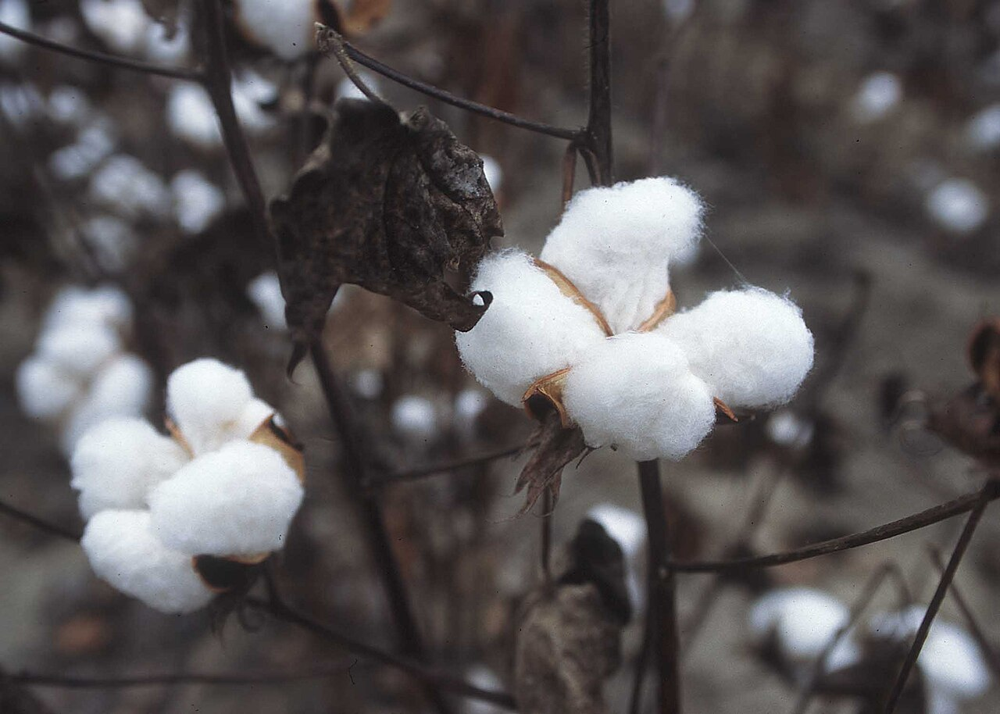

## Cotton Planting Risk Model

Maintaining uniform seedling emergence within the first 40 days after planting is often considered one of the most critical factors influencing cotton yield (Stewart and Faircloth 2007). Although acceptable yields can be achieved with uniformly spaced stands as low as 15,000 plants per acre, recommended final stands typically range from 20,000 to 50,000 plants per acre. Recommended seeding rates depend on row spacing, soil conditions, and seedling disease pressure (Adams et al. 2019).

This model estimates the probability that a planting population will fall below a user-defined stand threshold. The model is based on planting population, Pythium presence, minimum air temperatures occurring within 9 days after planting, and cumulative rainfall during the first 3 days after planting. The model does not account for reduced seed viability, planting errors, soil crusting, rapid soil drying, insect pressure, or other factors that may limit vigorous seedling growth.

The model was built assuming no seed treatments were used. Utilization of seed treatments containing fungicides active against *Pythium* spp., *Rhizoctonia solani*, *Fusarium* spp., and *Thielaviopsis basicola* can support higher plant stands (Faske et al. 2025; Rothrock et al. 2012).

### Model Details

This model was developed by Dr. Zachary Noel, University of Auburn. The model estimates the probability of an emerged stand falling below the yield-limiting stand, based on planting population, pythium presence, minimum temperatures in the 9 days preceeding planting, and rainfall in the 3 days after planting.

### References:

- Adams, C., Thapa, S., and Kimura, E. 2019. Determination of a plant population density threshold for optimizing cotton lint yield: A synthesis. Field Crop. Res. 230:11-16.

- Faske, T. R., Kirkpatrick, T. L., Rothrock, C. S., and Woodward, J. E. 2025. Part I: infectious diseases. Pages 8-22. in: Compendium of Cotton Diseases and Pests, 3rd ed. Faske, T.R., Kirkpatrick, T.L., Rothrock C.S., J.E. Woodward, ed. St. Paul, MN: The American Phytopathological Society. https://doi.org/10.1094/9780890546949.002

- Rothrock, C. S., Winters, S. A., Miller, P. K., Gbur, E., Verhalen, L. M., Greenhagen, B. E., Isakeit, T. S., Batson, W. E., Jr., Bourland, F. M., Colyer, P. D., Wheeler, T. A., Kaufman, H. W., Sciumbato, G. L., Thaxton, P. M., Lawrence, K. S., Gazaway, W. S., Chambers, A. Y., Newman, M. A., Kirkpatrick, T. L., Barham, J. D., Phipps, P. M., Shokes, F. M., Littlefield, L. J., Padgett, G. B., Hutmacher, R. B., Davis, R. M., Kemerait, R. C., Sumner, D. R., Seebold, K. W., Jr., Mueller, J. D., and Garber, R. H. 2012. Importance of fungicide seed treatment and environment on seedling diseases of cotton. Plant Dis. 96:1805-1817.

- Stewart, S., and Faircloth, J. 2007. The First Forty Days™ Through Fruiting to Finish™. Pages 579-586 in: Proc. of Beltwide Cotton Production Conference. National Cotton Council of America.
