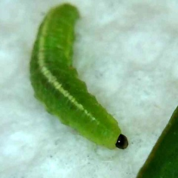

## Alfalfa Weevil

*Hypera postica*, commonly known as the alfalfa weevil, is a species of beetle in the superfamily Curculionoidea; it can be found in alfalfa fields throughout Europe and North America. Considered a destructive threat to alfalfa production in North America, several accidental introductions have been successfully countered though the use of a variety of biological control species.

The alfalfa weevil grows to a length of about 4 to 5.5 mm (0.16 to 0.22 in). The rostrum or beak is short and broad. The frons is half as wide as the rostrum while the pronotum is broadest in the centre. The general colour of the insect is brown, with a dark mid-dorsal stripe. The larva has a distinctive black head and no legs; it is yellowish-green, with a white dorsal stripe and faint white lateral stripes. It is about 1 cm (0.4 in) long just before pupation. It pupates in a white, pea-sized cocoon made of loosely-woven silk. It resembles the clover leaf weevil (*Hypera punctata*), but that species is nearly twice as large, the larvae have tan heads and they seldom cause much damage to alfalfa crops.

In the midwest, some eggs are laid in the late fall or the winter, when weather conditions permit. Adults also overwinter and become increasingly active in March and April. Eggs are laid in batches of up to 25 inside alfalfa stems. The larvae feed for three or four weeks, moulting three times, before pupating in the cocoons they make. They emerge as adults in about one or two weeks. After feeding for a week or two, they may experience aestivation during the remainder of the summer, in which they demonstrate a dampening of their metabolic, respiratory and nervous system activities. In fall, the adults hide in the crowns of alfalfa plants or move onto coarse vegetation in ditches or by fences or in nearby woodland.

We use a base 48°F (9°C) degree day model to estimate feeding risk from developing alfalfa weevil larvae.

### More Information

- <https://vegedge.umn.edu/alfalfa-weevil>
- <https://en.wikipedia.org/wiki/Hypera_postica>
