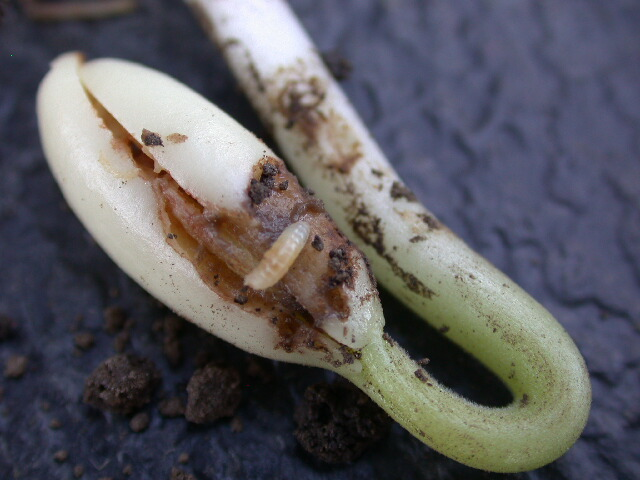

## Seedcorn Maggot

 The seedcorn maggot (*Delia platura*) is a perennial pest of the germinating seeds and young seedlings of a wide range of vegetable and agronomic crops. In addition to corn, seedcorn maggots (SCM) has a large host range including numerous common vegetable crops. SCM can cause economic damage to seeds of artichoke, beet, Brussels sprouts, cabbage, cantaloupe, carrot, cauliflower, cucumber, kale, lettuce, bean (lima, snap, red), onion, pea, pumpkin, tomato, and turnip. In high numbers SCM can decimate entire crop stands if left untreated. SCM can be an increasing problem when susceptible crop crops are planted in succession.

Larvae are typical of many other fly maggots: 7 mm when fully grown, cream-colored, legless, and wedge-shaped. The head of the maggot is sharply pointed. SCM pupae are dark brown, 5 mm long, cylindrical in shape, and evenly rounded on both ends. SCM spends between 7-14 days in the pupal stage at normal summer time temperatures (~70°F). Adult flies resemble miniature houseflies. They are dark gray with black legs, 4-5 mm long and commonly hold their opaque wings flat over their abdomen when at rest.

Seed corn maggots overwinter as pupae in the soil. Adult flies begin emerging in the late spring, peak emergence for the first generation occurs in early to mid-May. Adult SCM often swarm over recently tilled fields or gardens. Preferred egg deposition sites are locations with germinating or decaying seeds, plant residue, incorporated green manures or where organic fertilizers have been recently applied. Adults often mate and lay eggs within 2-3 days of emergence. Eggs hatch 2-4 days later depending on soil temperature.

The larval portion of the SCM life cycle occurs below ground over the course of a few weeks. Once hatched larvae burrow into the soil 6-8 cm to locate food resources. A complete life cycle for SCM can range from 15-77 days, in a typical season 16-21 days is sufficient. In Wisconsin, there are typically 3-5 generations per year.

We use a base 39.2°F (4°C) degree day model.

### References

- <https://vegento.russell.wisc.edu/pests/seedcorn-maggot/>
